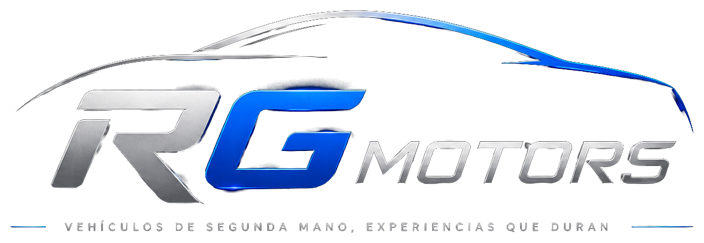

<div align="center">



# RG Motors — Plataforma de Autos Usados

**E-commerce automotriz de nueva generación para Chile.**
Catálogo inteligente, financiamiento en línea, reserva con pago parcial, comparador,
**tours 360° propios** y asistente con IA — con una estética *dark, premium y tecnológica*.

<br/>

[](https://nextjs.org/)
[](https://react.dev/)
[](https://www.typescriptlang.org/)
[](https://tailwindcss.com/)
[](https://threejs.org/)

</div>

---

## ✨ Sobre el proyecto

RG Motors es una automotora de vehículos de segunda mano. Esta plataforma fue diseñada
para **diferenciarse del mercado chileno** con funciones que las páginas tradicionales
no ofrecen: giro **360° del auto**, **simulación de crédito en tiempo real** y
**reserva online** con pago parcial — todo dentro de una experiencia visual de nivel
premium inspirada en marcas como BMW, Tesla, Porsche y Rivian.

> 💡 El **tour 360°** es una función más dentro de la ficha del auto (una pestaña),
> no el eje de toda la página. Está construido con tecnología **propia y gratuita**
> (Three.js + secuencia de fotos), **sin licencias de pago** como CarCutter.

---

## 🚀 Características principales

| | Función | Descripción |
|---|---------|-------------|
| 🔄 | **Giro 360° del auto** | Visor propio de fotos reales (arrastrar para girar, auto-rotación, pantalla completa) + modelo 3D interactivo de respaldo. |
| 🏠 | **Tour interior** | Panorama inmersivo del habitáculo con puntos destacados (Conductor / Trasera). |
| 💳 | **Crédito en tiempo real** | Simulador de cuota, CAE y costo total con pie y plazo configurables. |
| 📅 | **Reserva online** | Reserva del vehículo pagando una parte del valor (WebPay, transferencia, Mercado Pago, Flow, OnePay). |
| 🚗 | **Prueba de manejo** | Agenda por sucursal, día, hora y ejecutivo. |
| 🔍 | **Catálogo con filtros** | Marca, tipo, precio, año, combustible, transmisión y orden. |
| ⚖️ | **Comparador** | Compara hasta 3 vehículos lado a lado. |
| 🤖 | **Asistente IA** | Widget flotante "RG AI" que recomienda autos del catálogo. |
| 📊 | **Dashboards** | Panel de cliente (reservas, créditos, favoritos) y de administrador (KPIs, ventas). |

---

## 🔄 Visor 360° propio (sin costo)

El corazón innovador de la plataforma. Tres tecnologías, todas gratuitas:

- **Por fotos reales** — [`components/PhotoSpin360.tsx`](components/PhotoSpin360.tsx)
  Muestra una secuencia de fotos (24–36) dando la vuelta al auto. El usuario **arrastra
  para girar**. Ejemplo montado: **Mazda CX-5** con 24 fotogramas de estudio.
- **Modelo 3D interactivo** — [`components/Showroom3D.tsx`](components/Showroom3D.tsx)
  Auto 3D con Three.js: girar, zoom, **cambio de color en vivo**, hotspots y cyclorama de estudio.
- **Tour interior** — [`components/InteriorTour.tsx`](components/InteriorTour.tsx)
  Panorama equirectangular del interior con puntos interactivos.

### Cómo cargar el 360° por fotos de un auto real

1. Toma **24–36 fotos** dando una vuelta completa al vehículo (misma distancia y altura).
2. Renómbralas en orden: `001.jpg`, `002.jpg`, … y déjalas en `public/cars/spin/<slug>/`.
3. En [`lib/vehicles.ts`](lib/vehicles.ts) agrega `spin: { count: 24 }` a ese vehículo.

La pestaña **Tour 360°** de la ficha lo mostrará automáticamente.
Ver guía completa en [`public/cars/spin/README.md`](public/cars/spin/README.md).

---

## 🎨 Sistema de diseño

Paleta inspirada en marcas premium — regla **80 / 15 / 5** (oscuros / blancos / azul de marca):

| Color | Hex | Uso |
|-------|-----|-----|
| ⬛ Negro absoluto | `#090909` | Fondo principal |
| ⬛ Negro carbón | `#111315` | Header y footer |
| ⬛ Gris grafito | `#181A1F` | Tarjetas |
| 🟦 Azul premium | `#006CFF` | Botones, links, foco, CTA |
| 🟩 Verde | `#22C55E` | Crédito aprobado / disponible |
| 🟨 Amarillo | `#FACC15` | Reserva pendiente |
| 🟥 Rojo | `#EF4444` | Error / vendido |
| ⬜ Blanco | `#F8F9FB` | Texto principal |

> El objetivo: que **el vehículo sea el protagonista** y la interfaz pase desapercibida,
> con el azul eléctrico guiando la atención hacia las acciones importantes.

---

## 🛠️ Stack tecnológico

**Next.js 16** (App Router, SSR/SSG) · **React 19** · **TypeScript** · **Tailwind CSS** ·
**Three.js** · **@napi-rs/canvas** (generación de assets) · Deploy en **Vercel**.

---

## ⚡ Cómo ejecutarlo

```bash
# 1. Instalar dependencias
npm install

# 2. Entorno de desarrollo  ->  http://localhost:3000
npm run dev

# 3. Build de producción
npm run build
npm start
```

> Demo del 360°: `http://localhost:3000/vehiculo/mazda-cx5-2021` → pestaña **Tour 360°**.

### Scripts disponibles

| Script | Descripción |
|--------|-------------|
| `npm run dev` | Servidor de desarrollo |
| `npm run build` | Compila para producción |
| `npm run lint` | Linter |
| `npm run demo:frames` | Genera frames 360° de demostración |
| `node scripts/build-cx5-spin.mjs` | Monta el giro 360° del Mazda CX-5 |
| `node scripts/process-logo.mjs` | Procesa el logo (fondo transparente) |

---

## 📂 Estructura del proyecto

```
app/
  (site)/                    # Páginas públicas (header, footer y chat IA)
    page.tsx                 # Home
    catalogo/  comparador/  simulador/  contacto/
    vehiculo/[slug]/         # Ficha del auto (galería + 360° + crédito)
    reserva/[slug]/          # Reserva online con pago parcial
    prueba-manejo/[slug]/    # Agenda de prueba de manejo
  cuenta/                    # Dashboard del cliente
  admin/                     # Dashboard del administrador
components/
  SiteHeader · SiteFooter · ChatWidget · Logo
  VehicleCard · VehicleViewer
  Showroom3D · InteriorTour · PhotoSpin360      # Visores 360°
  CuotaSimulator · ReserveFlow · TestDriveForm
lib/
  vehicles.ts                # Datos de vehículos y utilidades
public/
  cars/                      # Imágenes y fotos 360° del inventario
  logo.png · logo-alt.png
scripts/                     # Generación de assets (frames, logo)
```

---

## 🗺️ Roadmap

- [ ] Base de datos real (**Supabase**) para inventario, reservas y usuarios.
- [ ] Autenticación real y panel admin con carga de autos y fotos.
- [ ] Pago real con **Transbank WebPay Plus**.
- [ ] Pre-calificación de crédito con financiera/bureau e informe **Autofact**.
- [ ] Giro 360° por fotos reales para todo el inventario.

---

## 👤 Autor

Proyecto desarrollado para **RG Motors** por [**MathiasAlejandr0**](https://github.com/MathiasAlejandr0).

<div align="center">
<sub>Hecho con ❤️ y mucho ☕ en Chile.</sub>
</div>
