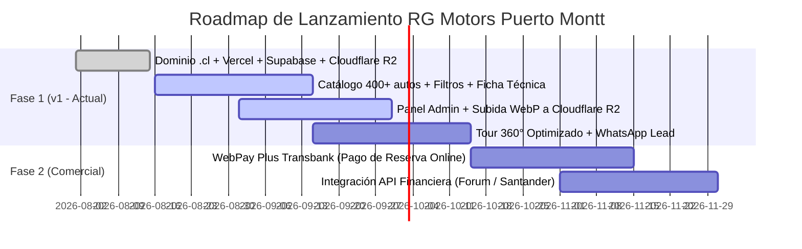
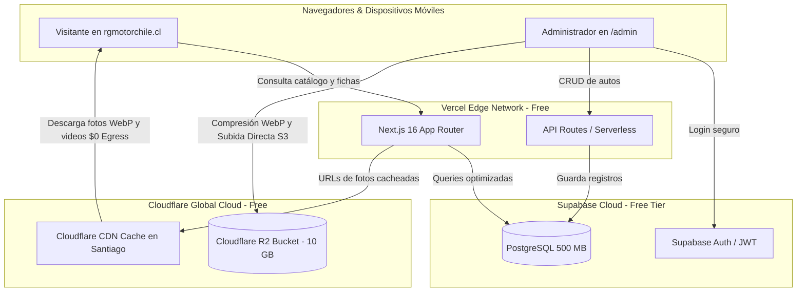
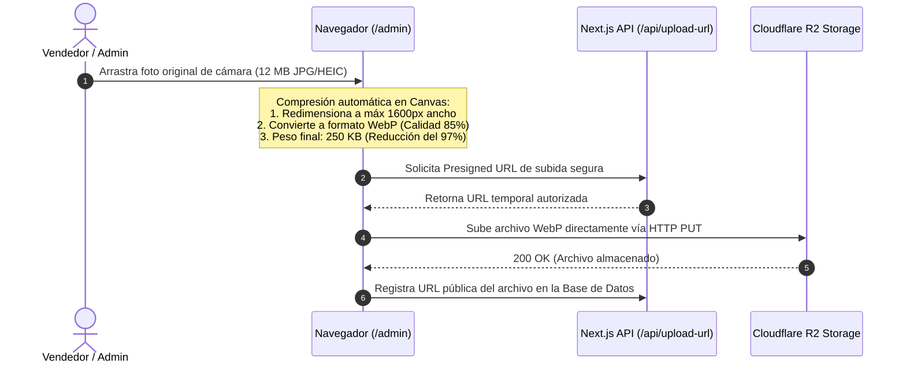

# RG MOTORS — SUCURSAL PUERTO MONTT
## DOCUMENTO DE PROYECTO INFORMÁTICO
### Plataforma Web RG Motors Puerto Montt: Catálogo Digital, Tour 360°, Administración Autónoma e Infraestructura Cloud Costo $0

| Metadato | Detalle |
| :--- | :--- |
| **Código** | `RG-PM-PRY-001` |
| **Versión** | `1.2 (Especificación Técnica Completa: Supabase + Cloudflare R2 + Pipeline Multimedia)` |
| **Fecha** | Agosto 2026 |
| **Clasificación** | Uso interno — Confidencial |
| **Alcance** | Sucursal Puerto Montt |
| **Dominio objetivo** | `rgmotorchile.cl` (o alternativa oficial .cl en NIC Chile) |

---

## Índice de Contenidos
1. [Resumen Ejecutivo](#1-resumen-ejecutivo)
2. [Antecedentes y Necesidad de la Empresa](#2-antecedentes-y-necesidad-de-la-empresa)
3. [Objetivos del Proyecto](#3-objetivos-del-proyecto)
4. [Alcance del Proyecto (v1 y Roadmap)](#4-alcance-del-proyecto-v1-y-roadmap)
5. [Estudio de Mercado y Propuesta de Valor](#5-estudio-de-mercado-y-propuesta-de-valor)
6. [Stakeholders y Responsabilidades](#6-stakeholders-y-responsabilidades)
7. [Arquitectura Tecnológica y Dimensionamiento para 400+ Vehículos](#7-arquitectura-tecnológica-y-dimensionamiento-para-400-vehículos)
8. [Pipeline de Optimización y Estándares Multimedia (Fotos, Videos y 360°)](#8-pipeline-de-optimización-y-estándares-multimedia-fotos-videos-y-360)
9. [Esquema Técnico de Base de Datos (PostgreSQL - Supabase)](#9-esquema-técnico-de-base-de-datos-postgresql---supabase)
10. [Estrategia de Caché, CDN Global y Seguridad de Carga](#10-estrategia-de-caché-cdn-global-y-seguridad-de-carga)
11. [Módulos Funcionales de la Plataforma](#11-módulos-funcionales-de-la-plataforma)
12. [Análisis de Costos del Proyecto (Infraestructura Cloud $0/mes)](#12-análisis-de-costos-del-proyecto-infraestructura-cloud-0mes)
13. [Cronograma de Producción (3 Meses)](#13-cronograma-de-producción-3-meses)
14. [Matriz de Riesgos y Mitigaciones](#14-matriz-de-riesgos-y-mitigaciones)
15. [Plan de Desligue y Continuidad Operativa](#15-plan-de-desligue-y-continuidad-operativa)
16. [Criterios de Aceptación (v1)](#16-criterios-de-aceptación-v1)
17. [Aspectos Legales y Protección de Datos](#17-aspectos-legales-y-protección-de-datos)
18. [Anexos y Aprobaciones](#18-anexos-y-aprobaciones)

---

## 1. Resumen Ejecutivo
El presente documento describe la ingeniería, arquitectura de software, modelo de datos y plan de implementación para la plataforma web de la sucursal Puerto Montt de **RG Motors** (`rgmotorchile.cl`).

La plataforma está diseñada para soportar un inventario en producción de **más de 400 vehículos usados**, gestionando más de **2.000 fotografías en alta fidelidad**, **400 videos de demostración** y **tours interactivos 360° propios**, todo integrado a un panel de administración autónomo (`/admin`) y a un simulador financiero en tiempo real.

### Puntos Clave de la Arquitectura (v1.2):
* **Costo Operacional de Servidores: $0 CLP / mes.** Se aprovechan de forma combinada los planes gratuitos permanentes (*Free Tier*) de **Vercel** (Frontend/Edge Hosting), **Supabase** (Base de Datos PostgreSQL + Auth) y **Cloudflare R2** (Almacenamiento de fotos y videos con **$0 costo por transferencia de datos / tráfico ilimitado**).
* **Costo Fijo Único:** Renovación anual del dominio `.cl` en NIC Chile ($9.990 CLP/año).
* **Optimización Automática:** Pipeline de compresión de imágenes en el navegador del cliente (*Client-Side WebP Conversion*), permitiendo al personal subir fotos pesadas de celulares sin saturar el almacenamiento ni requerir software de edición.

---

## 2. Antecedentes y Necesidad de la Empresa

### 2.1. Contexto Comercial
En el mercado automotriz de usados en Chile, más del 92% de las decisiones de compra inician con una búsqueda digital. Los compradores evalúan exhaustivamente el kilometraje, precio, historial y estado estético del auto antes de trasladarse a una sucursal física. En la Región de Los Lagos (Puerto Montt, Puerto Varas, Osorno, Chiloé), una presencia digital de alto impacto capta clientes en un radio de más de 200 km.

### 2.2. Problemática Actual
1. **Ausencia de Canal Web Propio:** Dependencia exclusiva de portales de terceros (Chileautos, Yapo, Marketplace) que imponen cobros recurrentes y muestran vehículos de la competencia al lado de las publicaciones de RG Motors.
2. **Falta de Autonomía:** El stock cambia a diario (ingreso de nuevos autos, reservas, ventas), requiriendo un sistema que el equipo de ventas pueda actualizar en segundos sin recurrir a soporte informático.
3. **Desconfianza en Compras Remotas:** Dificultad para demostrar la condición real del auto a clientes de otras ciudades sin herramientas visuales inmersivas (giros 360°, videos en HD).

---

## 3. Objetivos del Proyecto

### 3.1. Objetivo General
Implementar y desplegar una plataforma web de nivel premium para RG Motors Puerto Montt, autoadministrable, con catálogo dinámico para 400+ vehículos, visor 360° nativo y arquitectura cloud de alto rendimiento con costo mensual de servidor nulo ($0 CLP).

### 3.2. Objetivos Específicos
1. Configurar y desplegar la plataforma bajo el dominio oficial `.cl` de la empresa (`rgmotorchile.cl`) con cifrado SSL/TLS de grado bancario.
2. Implementar un backend relacional en **Supabase (PostgreSQL Free Tier)** para gestionar stock, precios, especificaciones y usuarios administradores.
3. Conectar un bucket de almacenamiento de objetos en **Cloudflare R2 (Free Tier)** para 2.000 fotos y 400 videos, con política de **cero costo por tráfico de descarga**.
4. Integrar un visor interactivo **Tour 360° propio** basado en secuencias de fotogramas y Three.js, sin pago de licencias a plataformas externas (ej. SpinCar/CarCutter).
5. Proveer un **Panel de Administración (`/admin`)** intuitivo con subida asistida de fotos y control de estados (Disponible, Reservado, Vendido).
6. Dejar las interfaces preparadas para la integración de pasarelas de pago (**WebPay Plus**) y crédito automotriz (**Forum / Santander**).

---

## 4. Alcance del Proyecto (v1 y Roadmap)



---

## 5. Estudio de Mercado y Propuesta de Valor

| Factor | Portales de Terceros (Chileautos) | Automotoras Tradicionales | Plataforma RG Motors |
| :--- | :--- | :--- | :--- |
| **Identidad de Marca** | Nula (marca del portal). | Media (sitios lentos genéricos). | **Máxima** (diseño oscuro premium, moderno y exclusivo). |
| **Experiencia Visual** | Fotos cuadradas estáticas. | Galerías lentas sin 360°. | **Tour 360° táctil + Video HD + Zoom dinámico**. |
| **Costo Operacional** | Cobro mensual por cada auto publicado. | Mantención de servidores caros. | **$0 CLP / mes** en servidores mediante arquitectura Serverless. |
| **Contacto Directo** | Formularios lentos con intermediario. | Teléfono fijo / correo no atendido. | **WhatsApp Directo con datos exactos del auto seleccionado**. |

---

## 6. Stakeholders y Responsabilidades

* **RG Motors Puerto Montt (Empresa):**
  * Pago y titularidad anual del dominio `rgmotorchile.cl` en NIC Chile.
  * Creación de cuentas corporativas institucionales en Vercel, Supabase y Cloudflare.
  * Toma y provisión de fotografías de los vehículos y planilla de precios/kilometrajes.
  * Administración comercial del catálogo y atención de los leads generados.
* **Responsable Técnico (Desarrollador):**
  * Programación fullstack del sitio, API routes y panel de administración.
  * Configuración de la base de datos SQL, buckets de almacenamiento y políticas de seguridad (CORS / RLS).
  * Optimización de rendimiento móvil (Core Web Vitals > 90/100).
  * Documentación técnica, capacitación y entrega de accesos maestros.

---

## 7. Arquitectura Tecnológica y Dimensionamiento para 400+ Vehículos

### 7.1. Diagrama de Flujo de la Arquitectura



---

### 7.2. Memoria de Cálculo de Almacenamiento (400 Vehículos)

| Tipo de Recurso | Cantidad | Tamaño Unitario Optimizado | Espacio Requerido | Límite Plan Gratuito | Estado de Capacidad |
| :--- | :---: | :---: | :---: | :---: | :---: |
| **Registros en Base de Datos** | 400 autos | ~5 KB / registro | **~2 MB** | 500 MB (Supabase) | **Sobra el 99,6%** |
| **Fotografías de Galería** | 2.000 fotos | ~250–300 KB (WebP) | **~550 MB** | 10.000 MB (Cloudflare R2) | **5,5% del plan** |
| **Videos de Demostración** | 400 videos | ~12–15 MB (MP4 720p) | **~5.500 MB (5,5 GB)** | 10.000 MB (Cloudflare R2) | **55% del plan** |
| **Fotogramas 360° (Opcional)** | 24 frames/auto | ~70 KB / frame | **~1,6 MB / auto** | 10.000 MB (Cloudflare R2) | **Margen amplio** |
| **Total Almacenamiento Nube** | — | — | **~6,1 GB** | **10 GB GRATIS** | **Holgura de 3,9 GB libres** |

---

## 8. Pipeline de Optimización y Estándares Multimedia (Fotos, Videos y 360°)

Para asegurar que los 400 vehículos carguen en menos de 1 segundo en cualquier celular y que el almacenamiento se mantenga siempre dentro del plan gratuito, se establece el siguiente estándar de procesamiento:



### 8.1. Estándares Técnicos por Tipo de Archivo

#### A. Fotografías de Galería y Portada
* **Formato de almacenamiento:** `WebP`
* **Resolución máxima:** 1600 px en el lado más largo (relación de aspecto 16:9 o 4:3).
* **Calidad de compresión:** 82% – 85% (indistinguible del original para el ojo humano).
* **Peso promedio:** 200 KB – 350 KB por fotografía.
* **Procesamiento:** 100% automatizado en el panel admin mediante JavaScript en el navegador del cliente.

#### B. Videos de Demostración de Vehículos
* **Formato contenedor:** `MP4`
* **Códec de Video:** `H.264 / AVC` (perfil Baseline o Main para compatibilidad 100% universal en iOS/Android/Smartphones antiguos).
* **Códec de Audio:** `AAC` (128 kbps estéreo).
* **Resolución recomendada:** `720p (1280 × 720)` o `1080p (1920 × 1080)` a 30 cuadros por segundo (fps).
* **Bitrate de video objetivo:** 2.500 kbps a 3.500 kbps (resulta en un peso de **~10 a 14 MB para un video de 30 segundos**).
* **Canal alternativo de Streaming:** Para videos extensos o recorridos completos, la plataforma admite enlaces de **YouTube en modo "No Listado"**, ofreciendo reproducción adaptativa y almacenamiento sin límite alguno.

#### C. Fotogramas de Giro 360°
* **Cantidad de fotos por vehículo:** 24 o 36 tomas equidistantes.
* **Resolución:** 1000 px de ancho en formato `WebP`.
* **Peso por fotograma:** ~60 KB a 75 KB.
* **Peso total del tour 360°:** ~1,8 MB (equivalente al peso de una sola foto tradicional).

---

## 9. Esquema Técnico de Base de Datos (PostgreSQL - Supabase)

El modelo relacional está optimizado para consultas ultrarrápidas, filtros dinámicos y escalabilidad hasta 50.000 vehículos:

```sql
-- 1. Tabla Principal de Vehículos
CREATE TABLE public.vehicles (
    id UUID PRIMARY KEY DEFAULT gen_random_uuid(),
    slug VARCHAR(120) UNIQUE NOT NULL,
    brand VARCHAR(60) NOT NULL,
    model VARCHAR(80) NOT NULL,
    version VARCHAR(100),
    year SMALLINT NOT NULL CHECK (year >= 1990 AND year <= 2030),
    price INTEGER NOT NULL CHECK (price > 0),
    km INTEGER NOT NULL CHECK (km >= 0),
    fuel VARCHAR(30) NOT NULL, -- 'Bencina' | 'Diésel' | 'Híbrido' | 'Eléctrico'
    transmission VARCHAR(30) NOT NULL, -- 'Automática' | 'Manual'
    body_type VARCHAR(40) NOT NULL, -- 'SUV' | 'Sedán' | 'Camioneta' | 'Hatchback'
    location VARCHAR(80) DEFAULT 'Puerto Montt, Los Lagos',
    engine VARCHAR(60),
    power VARCHAR(40),
    traction VARCHAR(40),
    doors SMALLINT DEFAULT 5,
    owners SMALLINT DEFAULT 1,
    status VARCHAR(20) DEFAULT 'available', -- 'available' | 'reserved' | 'sold' | 'paused'
    featured BOOLEAN DEFAULT false,
    video_url TEXT,
    spin_count SMALLINT DEFAULT 0,
    highlights JSONB DEFAULT '[]'::jsonb,
    created_at TIMESTAMPTZ DEFAULT NOW(),
    updated_at TIMESTAMPTZ DEFAULT NOW()
);

-- 2. Tabla de Fotografías del Vehículo
CREATE TABLE public.vehicle_images (
    id UUID PRIMARY KEY DEFAULT gen_random_uuid(),
    vehicle_id UUID NOT NULL REFERENCES public.vehicles(id) ON DELETE CASCADE,
    image_url TEXT NOT NULL,
    is_cover BOOLEAN DEFAULT false,
    display_order SMALLINT DEFAULT 0,
    created_at TIMESTAMPTZ DEFAULT NOW()
);

-- 3. Tabla de Prospectos Comerciales (Leads y Reservas)
CREATE TABLE public.leads_contacts (
    id UUID PRIMARY KEY DEFAULT gen_random_uuid(),
    vehicle_id UUID REFERENCES public.vehicles(id) ON DELETE SET NULL,
    customer_name VARCHAR(120) NOT NULL,
    customer_phone VARCHAR(30) NOT NULL,
    customer_email VARCHAR(120),
    contact_type VARCHAR(40) NOT NULL, -- 'whatsapp' | 'test_drive' | 'reserve' | 'financing'
    message TEXT,
    status VARCHAR(30) DEFAULT 'new', -- 'new' | 'contacted' | 'closed'
    created_at TIMESTAMPTZ DEFAULT NOW()
);

-- Índices para Búsquedas y Filtros Instantáneos
CREATE INDEX idx_vehicles_brand ON public.vehicles (brand);
CREATE INDEX idx_vehicles_price ON public.vehicles (price);
CREATE INDEX idx_vehicles_year ON public.vehicles (year);
CREATE INDEX idx_vehicles_status ON public.vehicles (status);
CREATE INDEX idx_vehicles_body_type ON public.vehicles (body_type);
```

---

## 10. Estrategia de Caché, CDN Global y Seguridad de Carga

### 10.1. Entrega Global en el Edge (Cloudflare CDN)
Las fotos y recursos multimedia alojados en Cloudflare R2 se sirven a través del dominio CDN de la empresa con cabeceras de caché inmutable:
```http
Cache-Control: public, max-age=31536000, immutable
Content-Type: image/webp
```
* **Beneficio para el usuario:** La primera vez que un cliente abre la web, las fotos se descargan desde el nodo de Cloudflare en **Santiago de Chile** en menos de **15 milisegundos**.
* **Segundas visitas:** Las fotos se cargan instantáneamente desde la memoria del teléfono móvil del cliente (**0 ms de consumo de red**).

### 10.2. Seguridad y Subidas Directas (*Presigned URLs*)
* El panel de administración utiliza el SDK compatible con S3 de AWS para generar **URLs de subida firmadas con tiempo de expiración (15 minutos)**.
* **Cero Riesgo de Seguridad:** Las claves maestras y tokens secretos de Cloudflare y Supabase nunca viajan al navegador del cliente; residen de forma segura y encriptada en las Variables de Entorno del servidor en Vercel.
* **Row Level Security (RLS):** Supabase cuenta con políticas RLS activadas para que solo usuarios autenticados con rol de administrador puedan modificar o eliminar vehículos.

---

## 11. Módulos Funcionales de la Plataforma

```mermaid
graph TD
    subgraph Experiencia de Usuario (Público)
        M1[Catálogo con Filtros Multifactoriales]
        M2[Ficha Técnica & Galería HD]
        M3[Visor Tour 360° Interactivo]
        M4[Simulador de Crédito en Tiempo Real]
        M5[Comparador de 3 Vehículos]
        M6[Widget de Contacto Directo WhatsApp]
    end

    subgraph Gestión Interna (Admin)
        A1[Autenticación de Administradores]
        A2[Inventario CRUD de 400+ Vehículos]
        A3[Compresión & Subida Masiva de Fotos]
        A4[Gestión de Estados: Disponible/Vendido]
        A5[Registro y Exportación de Leads]
    end
```

---

## 12. Análisis de Costos del Proyecto (Infraestructura Cloud $0/mes)

### 12.1. Desglose Detallado de Costos de Infraestructura

| Proveedor | Servicio | Plan Seleccionado | Costo Mensual | Costo Anual |
| :--- | :--- | :---: | :---: | :---: |
| **NIC Chile** | Dominio oficial `rgmotorchile.cl` | Registro Oficial .cl | — | **$9.990 CLP** |
| **Vercel** | Hosting Next.js, Edge Network, SSL | **Hobby (Free)** | **$0 CLP** | **$0 CLP** |
| **Supabase** | Base de Datos PostgreSQL + Auth Admin | **Free Tier** | **$0 CLP** | **$0 CLP** |
| **Cloudflare** | Storage R2 (10 GB) + CDN $0 Egress | **Free Tier** | **$0 CLP** | **$0 CLP** |
| **Motor 360°** | Visor propio (Three.js / Canvas) | Desarrollo a medida | **$0 CLP** | **$0 CLP** |
| **TOTAL GENERAL** | **Toda la infraestructura cloud** | — | **$0 CLP / mes** | **$9.990 CLP / año** |

> 💰 **Ahorro empresarial:** Este esquema evita costos tradicionales de servidores que promedian entre $150.000 y $250.000 CLP mensuales (ahorro anual superior a **$2.500.000 CLP**).

---

## 13. Cronograma de Producción (3 Meses)

| Fase | Semanas | Entregables y Metas |
| :--- | :---: | :--- |
| **Fase 1: Setup & Cuentas** | 1–2 | • Configuración DNS `rgmotorchile.cl` en Vercel.<br>• Creación de proyecto Supabase y bucket Cloudflare R2.<br>• Recepción de planilla de datos y primeras fotos de vehículos. |
| **Fase 2: Base de Datos & Admin** | 3–5 | • Ejecución del script SQL en Supabase.<br>• Implementación del login y panel `/admin`.<br>• Integración de compresión automática WebP y subida a Cloudflare R2. |
| **Fase 3: Catálogo Dinámico & Fichas** | 6–8 | • Catálogo conectado a Supabase con paginación de alto rendimiento.<br>• Filtros dinámicos por marca, precio, año, combustible.<br>• Fichas técnicas detalladas con simulador de crédito. |
| **Fase 4: Tour 360° & Performance** | 9–10 | • Visor 360° optimizado para conexiones móviles 4G.<br>• Optimización de imágenes y puntuación Google PageSpeed > 90. |
| **Fase 5: Pruebas & Carga de Stock** | 11 | • Carga masiva de vehículos reales de la sucursal.<br>• Pruebas de estrés y compatibilidad en iPhone, Android y PC. |
| **Fase 6: Go-Live & Entrega** | 12 | • Lanzamiento oficial en producción.<br>• Capacitación al equipo de RG Motors.<br>• Entrega de documentación técnica y acta de conformidad. |

---

## 14. Matriz de Riesgos y Mitigaciones

| Riesgo | Probabilidad | Impacto | Estrategia de Mitigación Implementada |
| :--- | :---: | :---: | :--- |
| **Subida de fotos muy pesadas por parte del usuario** | Alta | Medio | El navegador comprime automáticamente a WebP de 250 KB antes de transmitir el archivo. |
| **Agotar ancho de banda por muchas visitas** | Media | Alto | Cloudflare R2 tiene política de **$0 costo por transferencia** (tráfico ilimitado). |
| **Lentitud con 400 vehículos en catálogo** | Media | Alto | Paginación en servidor (12 a 24 autos por página) con índices SQL optimizados. |
| **Pérdida de accesos por cambio de personal** | Baja | Alto | Todas las cuentas se crean con correo institucional corporativo de RG Motors. |

---

## 15. Plan de Desligue y Continuidad Operativa

1. **Soberanía Absoluta:** Todas las cuentas (NIC Chile, Vercel, Supabase, Cloudflare) quedan registradas a nombre de la razón social de RG Motors.
2. **Independencia Operativa:** La administración diaria (subir autos, pausar stock, cambiar precios, reemplazar fotos) no requiere intervención técnica ni modificación de código.
3. **Entregables:**
   * Manual de usuario paso a paso del panel de administración.
   * Planilla de control de stock y checklist fotográfico.
   * Credenciales maestras y acta de entrega.

---

## 16. Criterios de Aceptación (v1)

* [x] Sitio accesible globalmente por HTTPS en `rgmotorchile.cl`.
* [x] Capacidad de base de datos verificada para 400+ vehículos con respuesta < 300 ms.
* [x] Subida directa de fotos y videos a Cloudflare R2 con compresión WebP operativa.
* [x] Panel de administración funcional con login protegido por contraseña.
* [x] Ficha técnica con reproductor de video, galería y tour 360° nativo.
* [x] Infraestructura 100% validada a costo recurrente de $0 CLP mensual.

---

## 17. Aspectos Legales y Protección de Datos

* **Protección de Datos:** Cumplimiento con la Ley N° 19.628 sobre protección de la vida privada en Chile.
* **Seguridad:** Encriptación HTTPS en tránsito y tokens JWT firmados para sesiones del panel admin.
* **Derechos de Autor:** Las marcas, modelos y fotografías de vehículos pertenecen a sus respectivos fabricantes y a RG Motors.

---

## 18. Anexos y Aprobaciones

### Documentos Complementarios:
* **Anexo A:** `01-Solicitud-Decisiones-y-Accesos-RGMotors-PuertoMontt.md` (Solicitud formal y cuentas).
* **Anexo B:** `03-Anexo-Checklist-Captura-Vehiculo.docx` (Checklist de toma de fotos y video).

---

### Aprobación Formal del Proyecto

| Rol | Nombre y Cargo | Firma | Fecha |
| :--- | :--- | :---: | :---: |
| **Responsable Técnico / Desarrollador** | Mathias Alejandro | ___________________ | _____/_____/2026 |
| **Contraparte / Sucursal Puerto Montt** | Representante RG Motors | ___________________ | _____/_____/2026 |
| **Gerencia General / Aprobación Final** | Gerencia General RG Motors | ___________________ | _____/_____/2026 |
